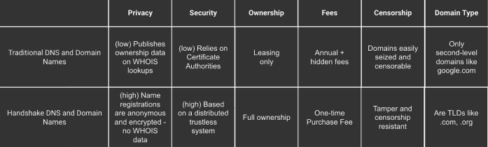

# 关于 Handshake

## Handshake is an experimental peer-to-peer root DNS

Handshake is a naming protocol that’s backwards compatible with the existing [DNS](../dns-refresher.md). It does not replace the DNS protocol, but it replaces the [root zone](../dns-refresher.md#root-zone) file (where TLD ownership is stored) and the [root servers](../dns-refresher.md#root-server) with a distributed and decentralized [blockchain](../blockchain-refresher.md)-based system that anyone can use. This allows the root zone to be uncensorable, permissionless, and free of gatekeepers like the ICANN which manages the root zone today.

Every peer in the network cryptographically validates and manages the root zone, which also removes the need for the Certificate Authority system (CAs) entirely. Names are logged on the Handshake blockchain—essentially one big distributed zone file that anyone has the right to add an entry in.

Existing TLDs like .com, .net, .org are blacklisted from being registered on the network and Handshake resolvers use traditional TLDs as the source of truth when you visit a traditional domain like [namebase.io](http://namebase.io/). Naturally, the Handshake resolvers use the Handshake blockchain as the source of truth when you visit a Handshake domain like welcome.nb/.

## The internet today is insecure and inefficient

### No true domain ownership

Current domain registrar have built their business on a leasing model, charging website owners an annual recurring leasing fee to rent a subdomain from the registrar's top-level domains (TLDs). These fees are subject to price hikes for most TLDs and recently ICANN was in the [spotlight](https://prospect.org/power/private-equity-corporate-takeover-org-domain-name/) for approving a deal that would remove price caps from protected TLDs like .org.&#x20;

### Top-level domains are limited

ICANN, the centralized entity that manages the root zone today, determines what top-level domains—like .com, .net, .org—are allowed. ICANN requires a $185,000 USD application fee to request a new TLD and applications for new TLDs are currently closed, which artificially limits the availability of good domains for website owners and developers.&#x20;

### The certificate authority system is inherently flawed

Browsers trust certificate authorities to prove that websites are who they say they are. However, certificate authorities have sometimes compromised the security of SSL by issuing bad certificates or cooperating with governments to spy on and censor traffic. Insecure websites put everyone at risk. Vint Cerf, the “Father of the Internet,” expands on this in his article about [self-authenticating identifiers.](https://cacm.acm.org/magazines/2018/12/232883-self-authenticating-identifiers/fulltext)

### Prone to censorship and loss of privacy

The current centralized nature of internet names results in a potential loss of privacy and censorship. Even if your domain registrar offers WHOIS protections, your information can still be subpoenaed from a domain registrar. Governments and ISPs commonly use DNS filtering and redirection to censor domains. ISPs on the other hand often monetize personal DNS data by [selling your web browsing history](https://arstechnica.com/information-technology/2017/03/how-isps-can-sell-your-web-history-and-how-to-stop-them/).&#x20;

## Handshake offers a better way

### Do more with owned domains

Handshake domains can be truly [owned](true-domain-ownership.md#ownership-and-renewal-fees) with no renewal fees. Domain owners have complete control over their data and can use their TLDs for anything—from simply hosting a website to becoming a registrar that sells subdomains to other users. Also since governance on Handshake is truly decentralized, no one person or entity can make a governance decision that would impact domain owners or the network the same way in which the ICANN deal could for .org domain owners.

### Endless top-level domains

Handshake domains are TLDs that anyone can register, not just ICANN. They can be used like a traditional TLD (i.e my.home/) or simply by themselves as a standalone name (i.e home/). Not only that, but they can also consist of **any** characters including Chinese (i.e. my.家/), Russian (i.e. my.домой/), and even emojis (i.e. my.🏡/)!

### A safer alternative to Certificate Authorities

Handshake shifts requiring trust in domain ownership from centralized, potentially insecure Certificate Authorities to a public commons that anyone can use for secure name resolution and certificate ownership.

### Unstoppable, privacy preserving, and permissionless

Handshake ensures DNS records can only be modified by a domain’s owner. This ensures Handshake domains can’t be censored or maliciously redirected. Registering a Handshake domain respects the privacy of the owner by requiring no personal data during registration. Ownership of names are determined by public-key cryptography, so it’s easy to verify name owners by having them sign a message with their private key.
