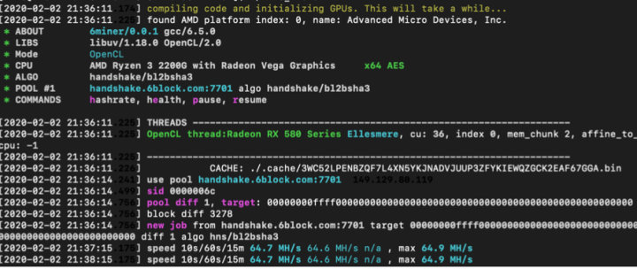

# Mining HNS

## Let’s get started.  

There are three main steps to get you ready to start mining HNS.&#x20;

1. [Register on Namebase to get your HNS wallet address](mining-hns.md#step-1:)
2. [Run 6block mining software](mining-hns.md#step-2:-run-6miner)
3. [Withdraw HNS to your HNS wallet address](mining-hns.md#step-3:-withdraw-to-your-hns-wallet-address)

## Step 1: Register on Namebase 

The first part of this process is to create a Handshake wallet address. To do this, simply [create](https://www.namebase.io/register) your Namebase account and complete your registration.

After completing your registration, you will notice a \[Dashboard] tab at the top navigation. When you arrive at the Dashboard page, you will notice a card that will show your available HNS balance. At the bottom of the card, you’ll notice a string of numbers. This is your HNS wallet address. You can easily copy this by using the clipboard feature next to your wallet address. See screenshot below for reference.&#x20;

## Step 2: Run 6miner   

This step requires registering, installing and running a Handshake mining software. This walkthrough uses 6miner and the 6block mining pool.&#x20;

To start this process, register for 6block [here](https://6block.com/register) before Handshake mining for the wallet address configuration, worker and revenue monitoring and payment records checking.

The algorithm of Handshake is blake2b+sha3.

### What is 6block?

6block is one of the first mining pools to be ready for the Handshake launch. 6block is built for performance and designed to be stable, fast and secure.

### What is 6miner?&#x20;

6miner is a highly optimized miner for Handshake and it performs over 20% faster than HandyMiner on most GPUs tested. It is a direct competitor to HandyMiner, which is also a very good miner.&#x20;

Links to both miners are provided and we encourage people to test and decide which option will suit them best.&#x20;

### Install GPU Drivers&#x20;

In order to mine Handshake, you will need to have your GPU's drivers installed in your computer. 6miner works with both AMD and Nvidia cards, here's how to install the drivers:&#x20;

#### Nvidia GPU&#x20;

Here's a very good tutorial on how to install Nvidia Drivers on Ubuntu: [https://www.linuxbabe.com/ubuntu/install‐nvidia‐driver‐ubuntu‐18‐04 ](https://www.linuxbabe.com/ubuntu/install%E2%80%90nvidia%E2%80%90driver%E2%80%90ubuntu%E2%80%9018%E2%80%9004)

#### AMD GPU&#x20;

Here's the official AMD tutorial for installing amdgpu‐pro on Ubuntu and CentOS: [https://amdgpu‐install.readthedocs.io/en/latest/ ](https://xn--amdgpuinstall-gm6g.readthedocs.io/en/latest/)

For Ubuntu, please make sure to download from this link—Version 19.50 is recommended as it'll support up to the 5700XT (aprox 240mh hashrate): [https://drivers.amd.com/drivers/linux/19.50/amdgpu‐pro‐19.50‐967956‐ubuntu‐18.04.tar.xz ](https://drivers.amd.com/drivers/linux/19.50/amdgpu%E2%80%90pro%E2%80%9019.50%E2%80%90967956%E2%80%90ubuntu%E2%80%9018.04.tar.xz)

### Setting up 6 miner

1. Go to http://github.com/6block/6miner/releases&#x20;
2. Download the release file, currently: https://github.com/6block/6miner/releases/download/v0.0.1/6miner‐v0.0.1‐amd64‐ linux.tar.gz&#x20;
3. Open the terminal and decompress the file: tar -xpf 6miner-v0.0.1-amd64-linux.tar.gz&#x20;
4. Go inside the folder that was just created: cd 6miner-v0.0.1-amd64-linux&#x20;
5. As seen below, open the mining script with your preferred editor, here we used "nano":nano mine\_hns.sh&#x20;
6. Edit the config and change the following: 6.1 POOL (if mining on a pool different from 6block)
7. USERNAME: This is the username you registered on the pool, you can do something like myusername.1 6.3 PWD: This can be anything, just a "x" will suffice 6.4 VENDOR: amd/nvidia depending on your GPU&#x20;
8. After you've finished, save and exit the file by pressing "ctrl +x and then press Y when asked"&#x20;
9. Start mining with ./mine\_hns.sh and press Enter

Currently there's only a Linux‐64bit build, please choose that one. The miner will work on any Linux distribution, please make sure to have the correct GPU drivers installed.

Note the 64.7 MH/s reading, that is your hashrate. This is from a Radeon RX 580 8GB. Pretty good results on this one. Go to https://6block.com and go to "My Homepage", this will show you your current dashboard and all the mining stats you'll need.&#x20;

### Setting up Handyminer&#x20;

Full install steps are detailed here: [https://github.com/HandshakeAlliance/HandyMiner‐CLI](https://github.com/HandshakeAlliance/HandyMiner%E2%80%90CLI)&#x20;

## Step 3: Withdraw to your HNS wallet address 

Go to [https://6block.com](https://6block.com), click on your email address in the top right corner and then "Settings".

From your settings, click on Mining Accounts and paste in your Namebase HNS wallet address to withdraw your HNS to Namebase.

All in all it should be straightforward to get started mining HNS. Visit the [Namer Community](https://discord.gg/A4f7CNr)'s #mining channel, where even the creators of these miners lurk, to ask about and discuss Handshake mining.
