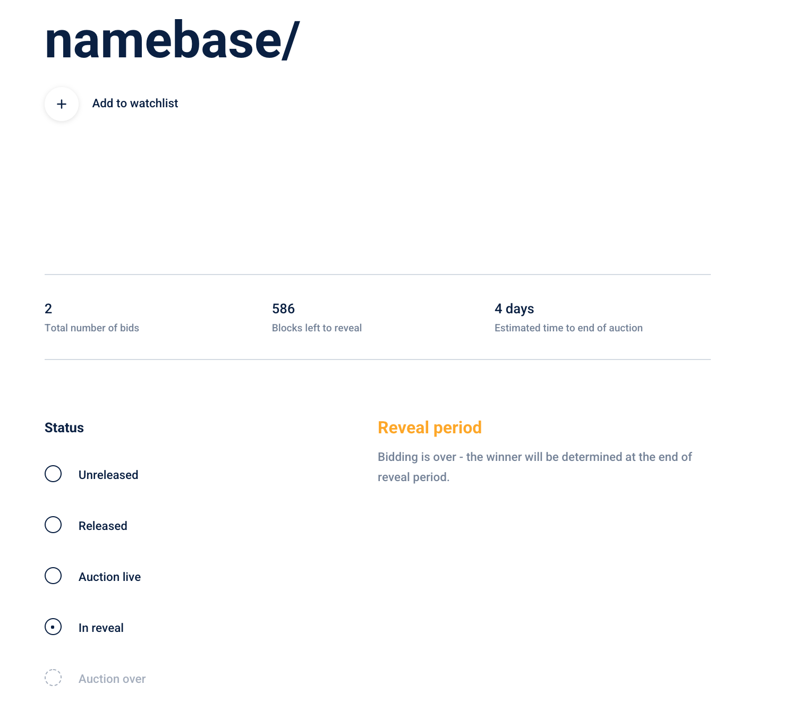
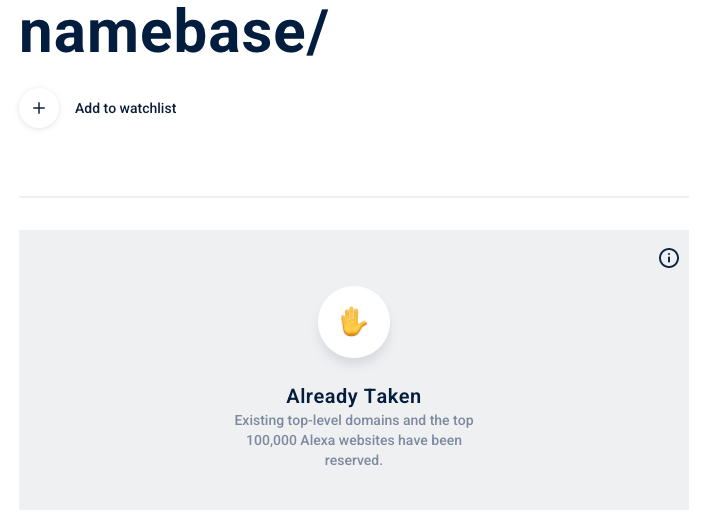

# Get Handshake names


Want a free Handshake name to play with before fully committing? 
Get a free Handshake name on our Discord server [here](https://discord.gg/V3aTrkp).


Make sure you fully understand how [Handshake auctions](../about-handshake/handshake-auction.md) work before bidding on Handshake names. You can check your understanding with [these case studies](../about-handshake/handshake-auction.md#case-studies).


You will need HNS in your Namebase account to get Handshake names. If you have not done so, please follow the walkthrough [here](buy-hns.md) to buy HNS.



This video covers how Handshake auctions work


## Name search

Visit [https://www.namebase.io/domains](https://www.namebase.io/domains) and use the Power search to find names you want to own. There are 6 possible results to your name search:

### Owned — listed for sale

This name was already minted. The name is owned by someone else and it's up for sale — you can immediately purchase it. If the seller has enabled "Make an Offer", you'll also be able to make them an offer for their name.

### Owned — unlisted

This name was already minted. The name is owned by someone else and it isn't up for sale. If the owner has enabled "Make an Offer", you'll be able to make them an offer on their name.

### Unopened auction

This [Handshake name auction](../about-handshake/handshake-auction.md) hasn't started and placing a bid on this — around 30 minutes to confirm — will begin the auction.&#x20;

### Active auction

This [Handshake name auction](../about-handshake/handshake-auction.md) is underway.&#x20;

### Revealing

This name's auction recently ended and the winner will receive their name once the [reveal period](../about-handshake/handshake-auction.md) ends.

### Reserved

This name is either one of the existing [\~1,500 blacklisted traditional TLDs or is reserved for a top 100,000 Alexa website](../about-handshake/about-handshake.md#existing-domains). If you are the owner of a reserved name, [follow these instructions](https://hsd-dev.org/guides/claims.html) to claim your Handshake name.

## More

Read about how [Handshake auctions](../about-handshake/handshake-auction.md) work before bidding.

Use [https://www.namebase.io/domain-manager](https://www.namebase.io/domain-manager) to keep track of all your domains

Visit the [Namer Community](https://discord.gg/V3aTrkp) to ask about and discuss bidding strategies. 

