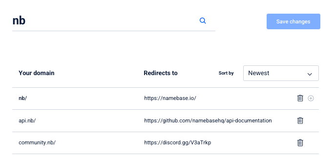

# Use Handshake names

You [truly own](../about-handshake/about-handshake.md#true-domain-ownership) your Handshake names, which means you're free to do anything you'd like with them. Below are some of the ways you can use your Handshake names through Namebase.


Share your resolvable Handshake name in the [Namer Community ](https://discord.gg/V3aTrkp)to become a Namer!




## Create a website

One of the most straightforward use cases of Handshake names is to set up a website on them. Check out the [Create Handshake websites](how-to-create-a-handshake-website.md) page for numerous tutorials on how on you can do so!

## Redirect your name

[Redirects](https://www.namebase.io/manage/redirects) allows you to redirect your Handshake name to any other domain, serving as a human-readable URL shortener. Hover over "Products" in the navbar and select "Redirects", then enter your redirects as follows:


Remember to include the "http://" or "https://" part of your redirect URL.


## Sell your name

Find your Handshake name in the [Domain Manager](https://www.namebase.io/domain-manager), select "Manage", and click the slider next to "Sell this domain" to set your name's "Buy now price" and list it for sale.&#x20;

You can edit your listings' Buy now prices or remove them altogether in your Domain Manager's [for sale](https://www.namebase.io/for-sale) page.

## Gift your name

Find your Handshake name in the [Domain Manager](https://www.namebase.io/domain-manager), select "Manage", and select "Gift this domain". Make sure the email address of your recipient is the same as their Namebase account's. If the recipient doesn’t have a Namebase account, they’ll be prompted to create one when they claim their name.

If the recipient doesn't claim their name by the expiration date, the name will be returned to your account.

## Sell subdomains

The [Namebase Registry](../about-namebase/revenue-streams.md#namebase-registry) is a service that enables you to sell subdomains on your Handshake TLD. [Click here](https://www.namebase.io/registry/) to start selling now.

[HNS.ID](https://hns.id/) is a service that allows you to sell decentralized subdomains on your Handshake TLD by using the Optimism Layer 2 ethereum network. Second level domains are minted as NFTs and can be managed on the HNS.ID platform.

## Use your name as your identity

The [Handshake Australia Mastodon instance](https://mastodon.hns.au) allows you to use your Handshake name as your identity. You can sign in with your Handshake name and use it as your handle.

[Handypedia](https://handypedia.org/) is a wiki about Handshake. You can use your Handshake name to sign in and edit articles.

[HNS Cloud](https://cloud.hns.au) is a cloud storage service hosted by [HNSAU](https://hns.au) that allows you to use your Handshake name as your identity.
